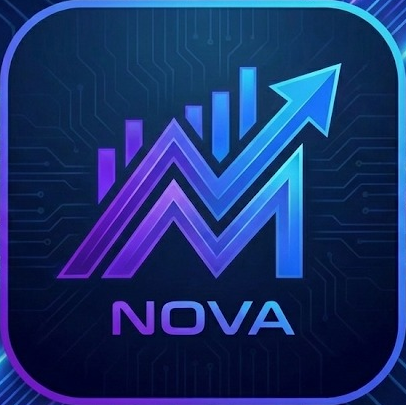
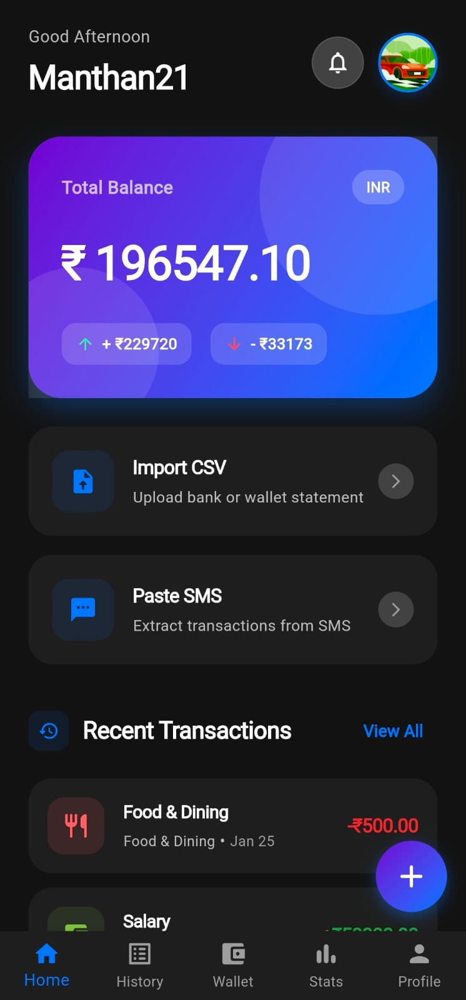
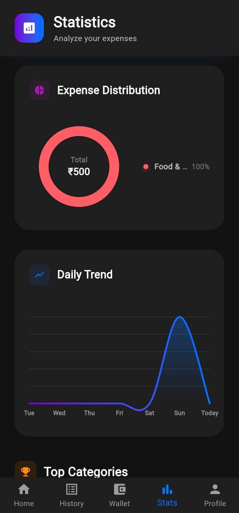
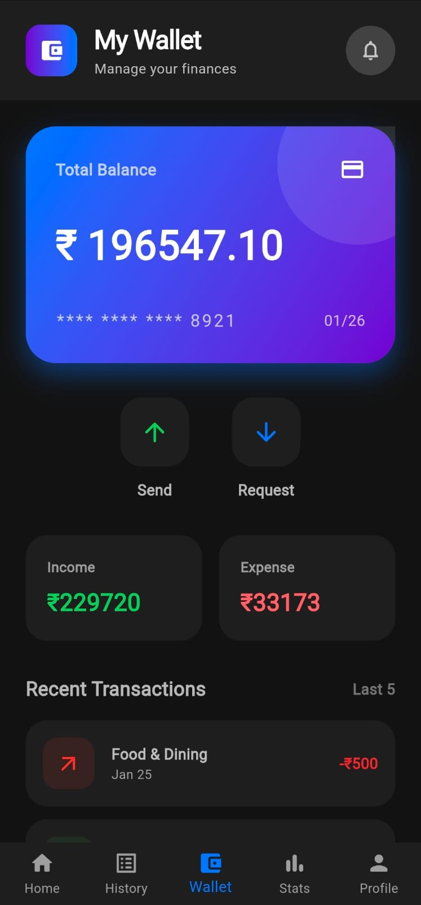
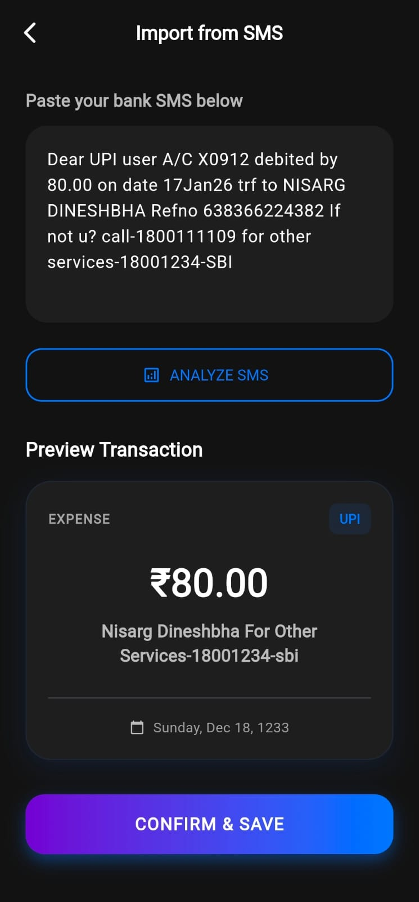
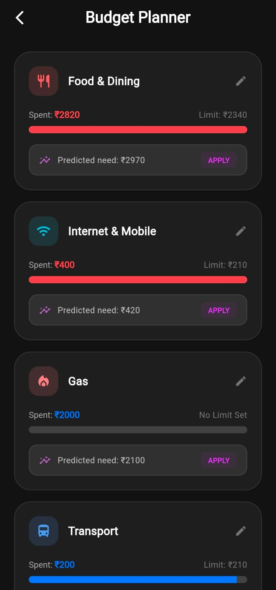
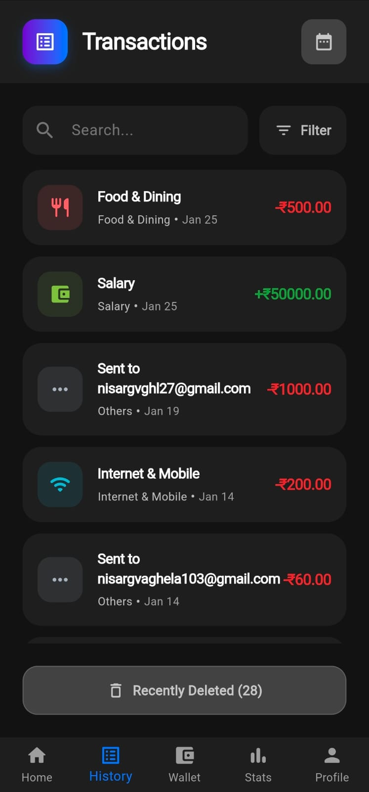

<div align="center">

  

  # Nova 🚀
  ### Finance Reimagined

  <p>
    A modern, intelligent expense tracking ecosystem built with Flutter & Firebase.
    <br>
    <b>Track. Predict. Save.</b>
  </p>

  <p>
    <a href="https://flutter.dev">
      
    </a>
    <a href="https://firebase.google.com">
      
    </a>
    <a href="https://dart.dev">
      
    </a>
    
  </p>
</div>

---

## 📱 App Overview

**Nova** isn't just another expense tracker. It is a complete financial management tool designed to automate your tracking habits. With features like **SMS Parsing**, **CSV Imports**, and **AI-powered Budget Predictions**, Nova takes the manual work out of personal finance.

Whether you are splitting bills, analyzing monthly trends, or securing your data with biometrics, Nova provides a seamless, beautiful UI in both Light and Dark modes.

## ✨ Key Features

### 🤖 Smart Automation
* **SMS Parser:** Automatically detects financial SMS from your clipboard and converts them into transactions (supports Regex for Indian banks/UPI).
* **CSV Import:** Bulk import bank statements directly into the app.
* **Budget Prediction:** Uses weighted average algorithms to predict your next month's spending based on history.

### 💰 Financial Management
* **Wallet System:** Send and Request money from other users via email.
* **Transaction Handling:** Add Income/Expense with categories, notes, and dates.
* **Visual Analytics:** Interactive Pie Charts and Trend Lines (Daily, Weekly, Monthly, Yearly).

### 🔐 Security & Personalization
* **Biometric Lock:** Secure your financial data with Fingerprint.
* **Cloud Sync:** Real-time data synchronization with Firestore.
* **Custom Profile:** Edit bio, location, profession, and profile picture.
* **Theme Support:** Beautiful native Dark and Light modes.

---

## 📸 Screenshots

<div align="center">

<table>
  <tr>
    <td align="center"><b>Home Dashboard</b></td>
    <td width="30"></td> <td align="center"><b>Analytics & Stats</b></td>
    <td width="30"></td> <td align="center"><b>Wallet & Payments</b></td>
  </tr>
  <tr>
    <td></td>
    <td></td> <td></td>
    <td></td> <td></td>
  </tr>
</table>

<br>

<table>
  <tr>
    <td align="center"><b>Smart Add / Import</b></td>
    <td width="30"></td> <td align="center"><b>Budget Prediction</b></td>
    <td width="30"></td> <td align="center"><b>Transactions History</b></td>
  </tr>
  <tr>
    <td></td>
    <td></td> <td></td>
    <td></td> <td></td>
  </tr>
</table>

</div>


---

## 🛠️ Tech Stack

* **Frontend:** Flutter (Dart)
* **Backend:** Firebase (Auth, Firestore)
* **State Management:** ValueNotifier & StreamBuilder
* **Key Packages:**
    * `fl_chart`: For beautiful statistical graphs.
    * `local_auth`: For biometric security.
    * `csv`: For parsing bank statements.
    * `file_picker`: handling file uploads.
    * `shared_preferences`: Local settings storage.
    * `intl`: Date formatting.

---

## 📂 Project Structure

```bash
lib/
├── constants/       # App-wide constants (Categories, Colors)
├── models/          # Data models (TransactionModel)
├── screens/
│   ├── auth/        # Login, Signup
│   ├── dialogs/     # CSV & SMS Import Dialogs
│   ├── home_screen.dart
│   ├── stats_screen.dart
│   ├── wallet_screen.dart
│   └── ...
├── services/        # Business Logic
│   ├── auth_service.dart
│   ├── budget_service.dart
│   ├── sms_parser_service.dart
│   └── ...
└── main.dart        # Entry point
```
## 🚀 Getting Started

### Prerequisites
* Flutter SDK
* Dart SDK
* Firebase Project Setup

### Installation

1.  **Clone the repository**
    ```bash
    git clone [https://github.com/your-username/nova.git](https://github.com/your-username/nova.git)
    cd nova
    ```

2.  **Install dependencies**
    ```bash
    flutter pub get
    ```

3.  **Firebase Configuration**
    * Create a project on [Firebase Console](https://console.firebase.google.com/).
    * Enable **Authentication** (Email/Password & Google).
    * Enable **Firestore Database**.
    * Use `flutterfire configure` to generate your `firebase_options.dart`.

4.  **Run the app**
    ```bash
    flutter run
    ```

---
